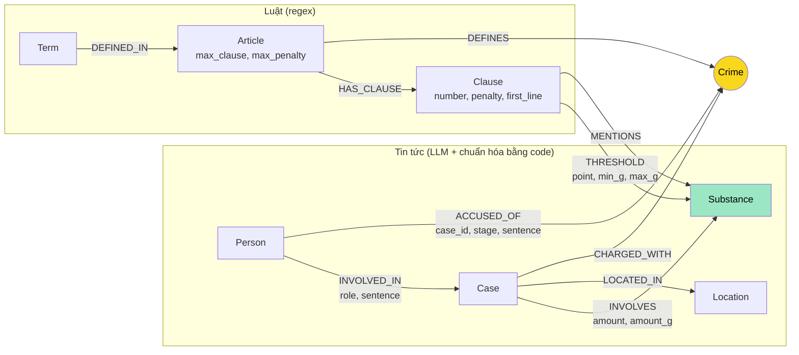

# Thiết kế Ontology — Day 19

**Họ tên:** Nguyễn Xuân Trường Giang  **MSSV:** 2A202602446

**Lựa chọn** (đánh dấu một):
- [ ] Dùng ontology gợi ý (có thể chỉnh nhỏ)
- [x] Tự thiết kế (xét bonus +15, xem `SUBMISSION.md`)

> Code: `src/graph.py`. Mặc định dựng ontology tự thiết kế; `KG_ONTOLOGY=hint` dựng lại ontology gợi ý để so sánh
> (`KG_ONTOLOGY=hint python bench_kg.py --judge --out ket_qua_benchmark_kg.hint.txt`).
> Bằng chứng Cypher: `report/evidence_custom_graph.txt` (graph tự thiết kế, đúng lần chạy của `ket_qua_benchmark_kg.txt`)
> và `report/evidence_hint_graph.txt` (graph gợi ý, đúng lần chạy của `ket_qua_benchmark_kg.hint.txt`).

## 1. Sơ đồ

`Crime` (vàng) là **node cầu nối** chính, đi tới từ cả `Case` và trực tiếp từ `Person`. `Substance` (xanh) là cầu nối thứ hai,
dùng để **chọn khoản** theo khối lượng: `Case -INVOLVES{amount_g}-> Substance <-THRESHOLD{min_g,max_g}- Clause`.

## 2. Entity types (node labels)

| Label | Ý nghĩa | Khóa định danh (`MERGE` theo) | Properties | Lấy từ KB nào | Trích bằng |
| --- | --- | --- | --- | --- | --- |
| `Article` | Một Điều luật | `id` ("Điều 250 BLHS") | `title`, `law`, `doc_id`, `max_clause`, `max_penalty` | Luật | regex (`parse_law_article_custom`) |
| `Clause` | Một khoản của Điều | `id` ("Điều 250 BLHS khoản 4") | `number`, `penalty`, `first_line`, `text`, `doc_id` | Luật | regex |
| `Crime` | Tội danh (cầu nối) | `name` đã chuẩn hóa ("vận chuyển trái phép chất ma túy") | — | Luật (tiêu đề Điều); tin chỉ được **nối vào**, không tạo mới | regex + `link_crime` |
| `Term` | Thuật ngữ định nghĩa trong Luật PCMT Điều 2 | `name` ("Tiền chất") | `definition`, `doc_id` | Luật | regex ("N. X là …") |
| `Substance` | Chất ma túy, tên chuẩn | `name` chuẩn ("MDMA", "Methamphetamine", "chất ma túy khác (thể rắn)") | — | Cả hai | `find_substances` (luật), LLM + `canonical_substance` (tin) |
| `Case` | Một vụ việc **như một bài báo kể** | `id` = `doc_id#i` (ổn định) | `name`, `summary`, `date`, `stage`, `doc_id`, `source_title` | Tin | LLM |
| `Person` | Người trong vụ việc | `name` họ tên đầy đủ, gộp qua biệt danh | `aliases` (hợp nhất qua các bài) | Tin | LLM + `merge_person_aliases` |
| `Location` | Tỉnh/thành | `name` chuẩn ("TP.HCM") | — | Tin | LLM + `canonical_location` |

Node dùng chung nhiều tài liệu (`Crime`, `Substance`, `Person`, `Location`) không mang `doc_id`; mọi node sinh từ đúng một tài liệu đều có `doc_id`.

## 3. Relationships

| Type | Từ → Đến | Properties trên cạnh | Ý nghĩa |
| --- | --- | --- | --- |
| `DEFINES` | Article → Crime | — | Điều luật định nghĩa tội danh |
| `HAS_CLAUSE` | Article → Clause | — | Điều có khoản |
| `THRESHOLD` | Clause → Substance | `point` (điểm a/b/…), `min_g`, `max_g` (gam; `max_g` null = "trở lên"), `text` | Khoản áp dụng cho chất trong khoảng khối lượng `[min_g, max_g)` |
| `MENTIONS` | Clause → Substance | — | Khoản nhắc chất nhưng **không** có ngưỡng khối lượng (vd Điều 247 trồng cây) |
| `DEFINED_IN` | Term → Article | — | Thuật ngữ được định nghĩa tại Điều |
| `CHARGED_WITH` | Case → Crime | — | Vụ việc liên quan tội danh (hợp của tội cấp vụ và tội của từng người) |
| `ACCUSED_OF` | Person → Crime | `case_id`, `stage`, `sentence` | Tội của **riêng** người đó trong một vụ, ở giai đoạn tố tụng nào, mức án |
| `INVOLVED_IN` | Person → Case | `role`, `sentence` | Vai trò của người trong vụ |
| `INVOLVES` | Case → Substance | `amount` (nguyên văn), `amount_g` (gam, số) | Chất và khối lượng thu giữ |
| `LOCATED_IN` | Case → Location | — | Nơi xảy ra |

## 4. Node cầu nối giữa 2 KB

- **Node nào:** `Crime`. Đường cầu: `(Person)-[:ACCUSED_OF]->(Crime)<-[:DEFINES]-(Article)` (2 cạnh) hoặc
  `(Case)-[:CHARGED_WITH]->(Crime)<-[:DEFINES]-(Article)`. Cầu phụ: `Substance` (nối khối lượng trong tin với ngưỡng trong luật).
- **Vì sao chọn node này:** câu hỏi xuyên KB luôn có dạng "người/vụ X bị xử tội gì → Điều nào → khung nào". Tội danh là thứ duy nhất
  vừa xuất hiện nguyên văn trong tiêu đề Điều luật vừa được nhà báo nhắc lại; tên người/vụ không có trong luật, số Điều hiếm khi có trong tin.
- **Cách đảm bảo hai phía khớp tên:**
  1. Danh sách tội danh chuẩn (lấy từ 13 tiêu đề Điều BLHS) được đưa **nguyên văn** vào prompt trích xuất.
  2. Kết quả LLM vẫn đi qua `link_crime` = `link_entity` (chuẩn hóa NFC + bỏ "Tội" + exact → `difflib` cutoff 0.8)
     **cộng thêm một chốt chặn**: nếu chuỗi trích được là phần con thực sự của tên chuẩn (thiếu vế định danh) thì từ chối.
  3. `Crime` chỉ được tạo từ luật; phía tin chỉ `MERGE` vào tên đã có, nên không thể sinh `Crime` "mồ côi".
- **Khi nào cầu gãy, và xử lý thế nào:**
  - Hành vi không phải tội hình sự (sử dụng ma túy, lái xe sau khi dùng ma túy) → **cố ý không nối** (vụ "tông CSGT ở An Giang").
  - Báo không nêu tội danh của người (chỉ "bị bắt") → `ACCUSED_OF` trống; vẫn đi được qua `Case-CHARGED_WITH` nếu vụ có tội danh.
  - Bài báo dính đoạn "tin liên quan" lúc crawl → sinh vụ phụ không có tội danh (xem §8). Truy vấn kiểm tra:
    `MATCH (k:Case) WHERE NOT (k)-[:CHARGED_WITH]->() RETURN k.name, k.doc_id`.

## 5. Competency questions

| Câu | Đường đi (Cypher pattern) | Trả lời được? |
| --- | --- | --- |
| Q1 | `(:Term {name:'Tiền chất'})-[:DEFINED_IN]->(:Article {id:'Điều 2 Luật PCMT'})` → `t.definition` | **Có**, trực tiếp từ graph (ontology gợi ý không có `Term`, chỉ dựa vào chunk vector) |
| Q2 | `(:Person)-[r:INVOLVED_IN]->(k:Case {doc_id:'news-100260928173914514'}) WHERE r.sentence CONTAINS 'tử hình'` | Có |
| Q3 | `(:Person {name:'Lê Minh Thành'})-[a:ACCUSED_OF]->(:Crime)<-[:DEFINES]-(ar:Article)-[:HAS_CLAUSE]->(:Clause {number:1})` → `a.sentence`, `cl.first_line` | Có |
| Q4 | `(p:Person) WHERE 'Hoàng Nato' IN p.aliases` `(p)-[:ACCUSED_OF]->(:Crime)<-[:DEFINES]-(a:Article)` → `a.max_penalty` (khoản `a.max_clause`) | **Có** (ontology gợi ý chỉ lấy khoản 1 vì Điều 255 không `MENTIONS` chất nào → thiếu "chung thân") |
| Q5 | `(:Person {name:'Cái Quang Huy'})-[:INVOLVED_IN]->(k)-[i:INVOLVES]->(s:Substance)<-[t:THRESHOLD]-(cl:Clause)<-[:HAS_CLAUSE]-(a:Article)-[:DEFINES]->(:Crime)<-[:CHARGED_WITH]-(k) WHERE i.amount_g >= t.min_g AND (t.max_g IS NULL OR i.amount_g < t.max_g)` | **Có**, ra đúng *Điều 250 khoản 4 điểm b* bằng phép so sánh số (gợi ý chỉ biết khoản nào "nhắc" MDMA → trả về cả 4 khoản) |
| Q6 | `(k:Case)-[:INVOLVES]->(:Substance {name:'MDMA'})` + `(p:Person)-[:INVOLVED_IN]->(k)` | Có, nhưng **phụ thuộc chất lượng trích xuất** (LLM có lần bỏ sót "kẹo"); graph còn tìm thêm vụ Hoàng Nato có "thuốc lắc" mà đáp án chuẩn không liệt kê |

## 6. Quyết định thiết kế và đánh đổi

1. **Ngưỡng khối lượng là cạnh `THRESHOLD{min_g,max_g}`, không phải node `Point`/`Threshold`.**
   Phương án khác: tách mỗi điểm thành node `Point` (Clause→Point→Substance). Chọn cạnh vì câu hỏi chỉ cần "khoản nào ứng với X gam chất Y" —
   một cạnh có thuộc tính số đủ để so sánh trong một `WHERE`, graph nhỏ hơn (239 cạnh thay vì 239 node + 478 cạnh).
   Đánh đổi: không biểu diễn được điều kiện phi khối lượng của điểm (tái phạm, có tổ chức, qua biên giới…), và "cần sa"/"côca" gộp nhiều dạng
   (nhựa/lá/quả) nên một chất có thể khớp 2 điểm khác nhau.
2. **`Case` khóa theo `doc_id#i`, không theo tên do LLM đặt.** Phương án gợi ý: `MERGE (k:Case {name})` — hai bài khác nhau mà LLM đặt cùng tên
   sẽ ghi đè `doc_id`/`summary` của nhau (chunk của bài đầu không còn tìm ra vụ). Đánh đổi: cùng một vụ ngoài đời được kể ở 3–4 bài thành 3–4 node
   `Case`; việc gộp được dời sang `Person` (người chung) — xem quyết định 3.
3. **Tội danh theo từng người (`ACCUSED_OF`) + gộp người qua biệt danh.** Phương án gợi ý: `charge` là chuỗi trên `INVOLVED_IN` nên không
   đi tiếp sang luật được, và `aliases` bị ghi đè ở mỗi bài. Ở đây `ACCUSED_OF` nối thẳng `Person→Crime` (cầu 2 bước) và mang `stage`
   (bắt giữ / khởi tố / truy tố / sơ thẩm / phúc thẩm) — tách được giai đoạn tố tụng khi cùng một người xuất hiện ở nhiều bài.
   Biệt danh nhiều từ ("Hoàng Nato") là khóa gộp; biệt danh 1 từ không dùng để gộp để tránh gộp nhầm.
4. **Chuẩn hóa chất trong code (`canonical_substance`), không tin hoàn toàn vào LLM.** Phương án khác: chỉ dặn LLM trong prompt (như gợi ý) —
   thực tế vẫn sinh `ketamine`/`Ketamine`, `thuốc lắc`/`MDMA`. Đánh đổi: bảng đồng nghĩa phải bảo trì tay.
5. **Context chọn lọc theo ý định câu hỏi.** Chỉ dựng khung hình phạt khi câu hỏi có từ khóa pháp lý (Điều/khoản/khung/tội/phạt…), và chỉ
   lấy dòng đầu của khoản (`first_line`) + khoản cao nhất + khoản khớp khối lượng thay vì cả văn bản khoản. Prompt GraphRAG giảm từ
   4604 xuống 2125 token/câu.

## 7. So với ontology gợi ý (bắt buộc nếu xét bonus)

Số liệu: `ket_qua_benchmark_kg.hint.txt` (gợi ý) vs `ket_qua_benchmark_kg.txt` (tự thiết kế), cùng provider `openrouter:openai/gpt-4o-mini`, top_k=3.

| Điểm khác | Gợi ý làm gì | Bạn làm gì | Vấn đề nó giải quyết | Bằng chứng (Cypher, hoặc số liệu benchmark) |
| --- | --- | --- | --- | --- |
| Ngưỡng khối lượng | `Clause-MENTIONS->Substance` (chỉ "có nhắc") | `Clause-THRESHOLD{point,min_g,max_g}->Substance` + `INVOLVES.amount_g` | Chọn đúng **một** khoản theo khối lượng (Q5) | Cypher Q5 trong `evidence_custom_graph.txt` trả đúng 1 dòng: `MDMA hơn 9,6kg → Điều 250 khoản 4 điểm b → phạt tù 20 năm, tù chung thân hoặc tử hình`. Graph Q5: câu trả lời nêu "khoản 4 điểm b của Điều 250" |
| Khung cao nhất | Lọc "khoản 1 + khoản nhắc chất của vụ" | `Article.max_clause/max_penalty`, luôn đưa khoản cao nhất khi câu hỏi hỏi về hình phạt | Q4 hỏi mức **tối đa** cho tội không gắn chất (Điều 255 không `MENTIONS` chất nào) | `MATCH (a:Article {id:'Điều 255 BLHS'})-[:HAS_CLAUSE]->(cl)-[:MENTIONS]->(s)` → **0 dòng** trên graph gợi ý. Q4 graph: recall **0.67 → 1.00**, judge **1 → 2** ("tù 20 năm hoặc tù chung thân") |
| Tội theo người + giai đoạn | `INVOLVED_IN.charge` (chuỗi) | `Person-ACCUSED_OF{case_id,stage,sentence}->Crime` | Đi thẳng người → tội → Điều; tách giai đoạn tố tụng | `ACCUSED_OF` = 33 cạnh, phân bố stage: bắt giữ 15, sơ thẩm 12, phúc thẩm 4, truy tố 2 |
| Gộp chất đồng nghĩa | Lưu nguyên tên LLM trả | `canonical_substance` (bảng đồng nghĩa + `link_entity`) | Trùng thực thể `Substance` (E3) | Gợi ý: 16 Substance gồm `Ketamine`+`ketamine`, `Methamphetamine`+`methamphetamine`, `thuốc lắc`, `ma túy`, `chất ma túy`. Tự thiết kế: 13 Substance, không còn cặp trùng; vụ Hoàng Nato ("thuốc lắc") được nối vào `MDMA` |
| Khóa `Case` | `name` do LLM đặt (ghi đè `doc_id` khi trùng tên) | `doc_id#i` | `doc_id` của vụ không bị bài sau ghi đè | Mỗi `Case` có `doc_id` cố định; bảng "Cases per doc" trong evidence |
| Chốt chặn nối tội | `link_entity` fuzzy cutoff 0.8 | `link_crime`: từ chối khi chuỗi là phần con thiếu vế | "sử dụng trái phép chất ma túy" (không phải tội) bị nối nhầm vào "tổ chức sử dụng…" | `link_entity('sử dụng trái phép chất ma túy', crimes)` → `'tổ chức sử dụng trái phép chất ma túy'`; `link_crime(...)` → `None` |
| Định nghĩa thuật ngữ | Không có | `Term-DEFINED_IN->Article` | Q1 trả lời được từ graph, không phụ thuộc chunk | `MATCH (t:Term {name:'Tiền chất'})-[:DEFINED_IN]->(a)` → `Điều 2 Luật PCMT` + định nghĩa |
| **Tổng** | | | | Graph recall **0.89 → 0.94**, judge **1.67 → 1.83**; in_tok/câu **4604 → 2125** (−54%), USD/câu **0.00073 → 0.00037** (−49%); build **$0.00942 → $0.01040** (+10%, prompt trích xuất dài hơn) |

Competency question ontology gợi ý trả lời **sai/thiếu** mà ontology mới trả lời được: **Q4** (thiếu khung cao nhất → thiếu "chung thân"),
**Q5** (không chọn được khoản theo khối lượng, chỉ biết khoản nào nhắc MDMA), **Q1** (graph gợi ý không có dữ kiện định nghĩa nào).

## 8. Hạn chế còn lại

- **Nhiễm "tin liên quan" lúc crawl:** cuối bài của Lê Minh Thành có đoạn giới thiệu vụ Cái Quang Huy; bài "Công nhân nói không với ma túy"
  có đoạn về "Đức Cộng". LLM tạo thêm vụ từ các đoạn đó → `Cái Quang Huy` có 2 `Case` (`news-100260918080821054#1` và `news-100260917203001265#0`).
  Cách sửa: cắt phần "tin liên quan" trong crawler, hoặc gộp `Case` khi cùng người + cùng chất + cùng khối lượng.
- **Cùng một vụ ngoài đời ở nhiều bài** (Hoàng Nato: 4 bài) vẫn là nhiều `Case`; chỉ `Person` được gộp.
- **LLM trích xuất không ổn định:** cùng prompt, temperature 0, lần chạy này có/không có `INVOLVES MDMA` cho vụ Lê Minh Thành ("kẹo").
- **Nhóm "người" bị coi là Person:** "7 công dân Trung Quốc".
- **Ngưỡng chỉ theo khối lượng rắn (gam/kilôgam):** chưa xử lý thể tích (mililít), "số viên", "chỉ", và điểm "có 02 chất trở lên… tổng khối lượng".
- **Điều kiện tăng nặng phi khối lượng** (có tổ chức, tái phạm, qua biên giới) chưa mô hình hóa nên không xác định được khoản khi khối lượng nhỏ.
